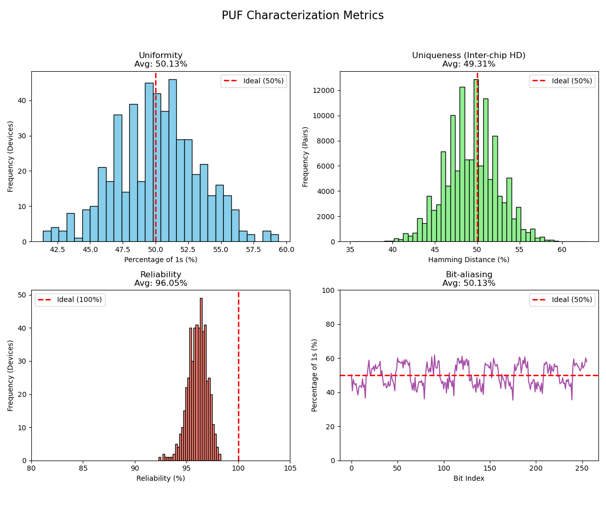

# 🔐 SRAM PUF Characterization & Fuzzy Extractor


  


## 📋 Table of Contents

- [Overview](#overview)
- [Repository Structure](#-repository-structure)
- [Hardware Setup & Toolchain](#-hardware-setup--toolchain)
- [Usage Guide](#-usage-guide)
- [Expected Results](#expected-results)
- [Python Dependencies](#-python-dependencies)
- [References](#-references)

## Overview
This repository contains a complete, end-to-end implementation of a **Physical Unclonable Function (PUF)** using the uninitialized state of Block RAM (SRAM) on a Lattice iCE40 FPGA. 

Raw physical entropy is notoriously noisy. This project demonstrates the full hardware security lifecycle:
1. **Extraction:** Designing a Verilog state machine to safely harvest power-on SRAM transients.
2. **Characterization:** Statistically evaluating the silicon fingerprint for Uniqueness, Uniformity, and Reliability.
3. **Cryptographic Application:** Implementing a **Fuzzy Commitment Scheme** (using Reed-Solomon Error Correction) to transform a ~96% reliable biological-like hardware fingerprint into a mathematically stable, 100% reliable 128-bit cryptographic key (e.g., for AES).

Note: Ideally, we'd have multiple FPGA devices as different PUF instances. Here, however, there is a resource limitation; only one FPGA is available.
To overcome this limitation, we treat responses from different SRAM blocks as different PUFs

## 📂 Repository Structure

```
├── rtl/                        # Hardware descriptions (Verilog)
│   ├── top_level.v             # Top-level integration
│   ├── puf_module.v            # 7-state FSM for synchronous memory extraction
│   ├── combined_ram.v          # Physical SB_RAM40_4K primitive instantiations
│   └── uart.v                  # RS232 UART transmitter/receiver
├── core/                       # Analysis & Cryptography (Python)
│   ├── get_puf_from_device.py  # Serial data acquisition script
│   ├── puf_eval.py             # Statistical characterization and plotting
│   └── fuzzy_extractor.py      # Reed-Solomon Fuzzy Commitment implementation
├── constraints/                # Physical FPGA mappings
│   └── LatticeiCE40HX8K.pcf    
├── data/                       # Sample 256-bit PUF response datasets
├── docs/                       # Figures and documentation
├── Makefile                    # Yosys/IceStorm build flow
└── README.md
```

## 🛠️ Hardware Setup & Toolchain

**Target Board:** Lattice iCE40HX8K (or compatible iCE40 family)

**Toolchain:** Project IceStorm (Yosys, arachne-pnr / nextpnr, icepack, iceprog)

### ⚠️ Critical Toolchain Note

The Makefile explicitly uses the `icepack -n` flag. This prevents the synthesis tool from zero-initializing the BRAM block, effectively preserving the physical entropy generated during the FPGA power-on phase.

## 🚀 Usage Guide

### Phase 1: Hardware Flashing & Data Acquisition

To extract the PUF data, the SRAM must be read immediately after a cold boot.

1. **Disconnect and reconnect** the FPGA via USB (True Cold Boot)
2. **Flash the bitstream** into volatile logic fabric (bypassing Flash memory to preserve SRAM state):

```bash
make clean
make prog
```

3. **Run the extraction script** (pass an integer argument to label sequential measurements):

```bash
python3 core/get_puf_from_device.py 0
```

### Phase 2: Statistical Characterization

Once multiple power-cycle measurements are gathered (e.g., 20 files), run the evaluation suite to calculate the standard PUF metrics across the Space, Time, and Device axes:

```bash
python3 core/puf_eval.py data/puf_data_*.txt
```

### Expected Results (Lattice iCE40 BRAM)

| Metric | Value | Ideal |
|--------|-------|-------|
| **Uniformity (Bias)** | ~50.1% | 50% |
| **Uniqueness (Inter-chip HD)** | ~49.3% | 50% |
| **Bit-Aliasing** | ~50.1% | 50% |
| **Reliability (Intra-chip HD)** | ~96.0% | 100% |



### Phase 3: Cryptographic Key Generation (Fuzzy Extractor)

Raw PUF bits cannot be used directly as cryptographic keys due to the ~4% bit error rate caused by thermal and voltage noise. The `fuzzy_extractor.py` script utilizes a **Fuzzy Commitment Scheme**.

By concatenating 512 bits of PUF data and utilizing `RSCodec(48)`, the algorithm provides enough parity overhead to correct up to 24 corrupted bytes, successfully hiding and recovering a 128-bit key without violating the Entropy-Leakage Bound.

```bash
python3 core/fuzzy_extractor.py
```

**Example Output:**

```
Original Key K = 87e69dc98abc504ef544efb6a76637e3
Public Helper Data W = a7bb345d4b130ab0b863f8c92aecdb8adfddc6343b7be4f023ae35d2870983c48cc9a5c1f3f57ac1d5253ac66c47af260e5b3c44df0b290d59e8eb2af67e62f9
Recovered 128-bit Key: 87e69dc98abc504ef544efb6a76637e3
SUCCESS: ECC fixed bytearray(b'?<:0," \x0e\t\x08\x07\x02\x01') byte error(s)!

--- FINAL VERIFICATION ---
Original Key = 87e69dc98abc504ef544efb6a76637e3
Recovered Key = 87e69dc98abc504ef544efb6a76637e3
Success! The raw PUF is now a stable AES key!
```

## 📦 Python Dependencies

```bash
pip install numpy scipy matplotlib reedsolo
```

## 📚 References

[1] A. Maiti, V. Gunreddy, and P. Schaumont, "A systematic method to evaluate and compare the performance of physical unclonable functions," in *Embedded Systems Design with FPGAs*. Springer, 2013, pp. 245–267. [[PDF](https://eprint.iacr.org/2011/657.pdf)]

This project implements the standardized PUF evaluation methodology presented in [1], which provides a rigorous framework for measuring PUF quality across three critical dimensions:

- **Uniformity:** Ensures that PUF responses are unbiased, with bits equally likely to be 0 or 1
- **Uniqueness:** Validates that different devices produce uncorrelated responses (Hamming Distance ~50%)
- **Reliability:** Quantifies the reproducibility of responses under varying environmental conditions

The metrics, statistical equations, and expected results presented in this repository are derived directly from the evaluation methodology in [1]. Our measured performance on the Lattice iCE40 BRAM demonstrates excellent alignment with the theoretical predictions for entropy-based PUFs.